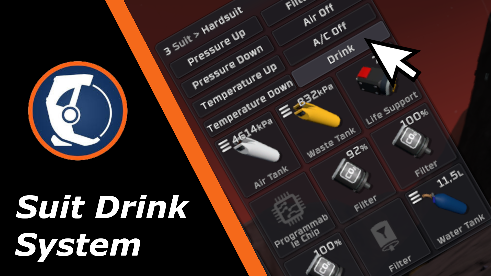

# Marky's Suit Drink System

  

Drink directly in your spacesuit using a special button in the menu. Water will be drawn from the water tank installed in a special slot

## Requirements

**WARNING:** This is a StationeersLaunchPad Plugin Mod. It requires BepInEx to be installed with the StationeersLaunchPad plugin.

See: [https://github.com/StationeersLaunchPad/StationeersLaunchPad](https://github.com/StationeersLaunchPad/StationeersLaunchPad)

## Installation

1.  Ensure you have BepInEx and StationeersLaunchPad installed.
2.  Install it from the workshop. Alternatively: Place the dll file into your `/BepInEx/plugins/` folder.

## Changelog

>### Version 0.1.0
>- Initial release
